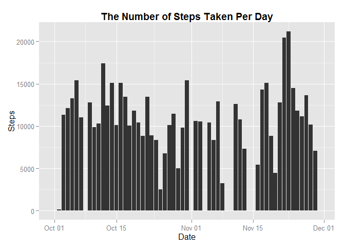
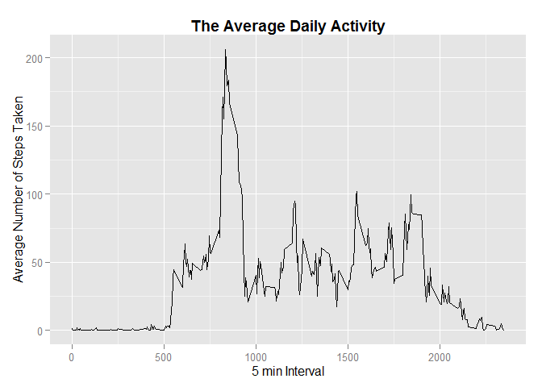
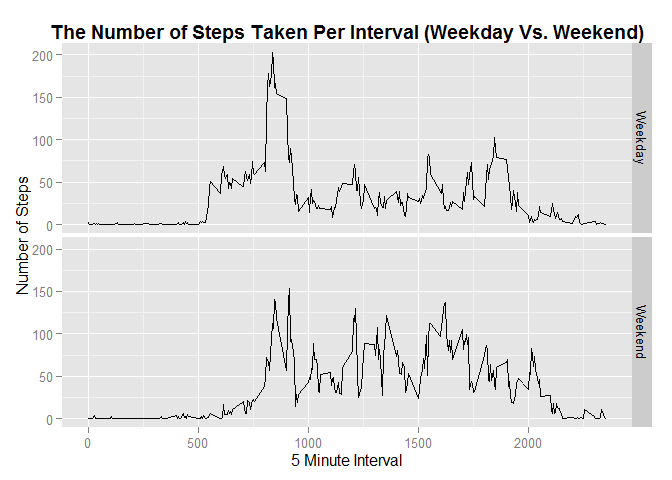

# Reproducible Research: Peer Assessment 1


##1. Loading and preprocessing the data
Check to see if the data file (activity.csv) is present in the working directory. If not, download the compressed data file from the url.


```r
fileName <- "activity.csv"
zfileName <- "repdata-data-activity.zip"
if(! file.exists(fileName)) {
        message("File doesn't exist. Downloading zipped file from the archive")
        fileURL="https://d396qusza40orc.cloudfront.net/repdata%2Fdata%2Factivity.zip"
        download.file(url=fileURL,destfile=fileName)
}
```


Check to see if data file (activity.csv) is uncompressed. If not extract data from the compressed file. 


```r
if(! file.exists("activity.csv")) {
        message("Extracting the data set files")
        unzip(zipfile=zfileName)
}
```


Load the data file, convert 'variable' date into 'class' date and load required libraries for the analysis. 


```r
actData <- read.csv("activity.csv") # Load the data (i.e. read.csv())
actData$date <- as.POSIXct(actData$date) # Convert dates to POSIXct class dates
library(ggplot2) #load ggplot2 package
library(tidyr) #load tidyr package
library(dplyr) #load dplyr package
```

```
## 
## Attaching package: 'dplyr'
## 
## The following objects are masked from 'package:stats':
## 
##     filter, lag
## 
## The following objects are masked from 'package:base':
## 
##     intersect, setdiff, setequal, union
```


##2. What is mean total number of steps taken per day?


Number of steps taken at an interval of 5 min for each day were recorded. To get the mean and median number of steps taken per day, number of steps taken in a day should be calculated.


```r
#1. Calculate the total number of steps taken per day.
gsteps <- group_by(actData, date) #group data by date
nsteps <- summarise(gsteps, steps = sum(steps, na.rm = TRUE)) #sum steps by day

#2. Get the mean and median of total steps taken per day. 
meanSteps <- round(mean(nsteps$steps))
medianSteps <- median(nsteps$steps)

#3 Make a bargraph of number of steps taken per day. 
ggplot(data = nsteps, aes(x = date, y = steps)) +
                geom_bar(stat = "identity") +
                xlab("Date") +
                ylab("Steps") +
                ggtitle("The Number of Steps Taken Per Day")+
                theme(plot.title = element_text(face="bold"))
```

 


The average (mean) number of steps taken per day are 9354.


The median number of steps taken per day are 10395.

##3.  What is the average daily activity pattern?

Make a time series plot (i.e type = "l") of the 5 min interval (x-axis) and the average number of steps taken, averaged across all days (y-axis)


```r
#1. Calculate mean number of steps taken per 5 min interval
dsteps <- aggregate(steps ~ interval, data = actData, FUN = mean)
#2. Find the maximum no of steps in any given 5 min interval
maxinterval <- dsteps[which.max(dsteps$steps), c("interval")] #find interval with max steps
maxintervalsteps <- round(dsteps[which.max(dsteps$steps), c("steps")]) #steps in max interval
#plot avg no of steps taken vs 5 min interval. 
ggplot(data = dsteps, aes(x = interval, y=steps)) +
        geom_line() +
        xlab("5 min Interval") +
        ylab("Average Number of Steps Taken")+
        ggtitle("The Average Daily Activity")+
        theme(plot.title = element_text(face="bold"))
```

 


On an average across all the days in the datasheet, the 5-minute interval that had maximum number of steps is "835" and it had "206" steps in it. 


##4.  Imputing missing values

Calculate and report the total number of missing values in the dataset (i.e total number of rows with NAs)


```r
nasteps <- sum(is.na(actData))
```

Total numver of missing values in the dataset are 2304. 


####Devise a strategy to fill missing values in dataset. 

There are 3 easy stratagies for replacing missing values. 

1. Mean number of steps per day: can be used to replace missing values. However, this stratagey is not going to work because to get the mean across all days, every day must have some value (number of steps taken). But there are few days in which all intervals have missing values.  

2. Mean number of steps per interval: can be used to replace missing values. By this method, mean number of steps taken per interval would not change across entire dataset. However, total number of steps taken per day would change and eventually this effects the mean number of steps taken per day. This strategy will change the final result which is not a desired in data analysis. 

3. Zero can be used to replace missing values. By this method, the mean or median number of steps taken per an interval or a day would not change. 

Because of the above mentioned reasons, I decided to replace missing values with zero.


Replace missing values with zero steps per interval and create a new dataset that is equal to original dataset with missing data filled. 


```r
actData2 <- actData %>% replace_na(list(steps = 0))
#Check to see if there are any missing values in new data
sum(is.na(actData2))
```

```
## [1] 0
```


Do the following with the new dataset. 

 1. Make a histogram of total number of steps taken each day.
 2. Calculate mean and median total number of steps taken per day. 
 3. Do these values differ from the estimates from the first part of the assignment?
 4. What is the impact of imputing missing data on the estimates of the total daily number of steps?


```r
#1. Calculate the total number of steps taken per day with new dataset.
gsteps2 <- group_by(actData2, date) #group data by date
nsteps2 <- summarise(gsteps2, steps = sum(steps)) #get the sum of steps per day. 

#2. Get the mean and median of total steps taken per day with new dataset. 
meanSteps2 <- round(mean(nsteps2$steps))
medianSteps2 <- median(nsteps2$steps)

#3 Make a bargraph of number of steps taken per day. 
ggplot(data = nsteps2, aes(x = date, y = steps)) +
                geom_bar(stat = "identity") +
                xlab("Date") +
                ylab("Steps") +
                ggtitle("The Number of Steps Taken Per Day")+
                theme(plot.title = element_text(face="bold"))
```

 


The average (mean) number of steps taken per day in old dataset are 9354 and new dataset are 9354 and it didn't change. 

The median number of steps taken per day in old dataset are 10395 and new dataset are 
10395 and it didn't change. 

In general, replacement of missing values with zero shouldn't affect the new mean. As expected the new mean and median are same as old mean and median. 


##5.  Are there differences in activity patterns between weekdays and weekends?


Create a new column "day_type"" that specifies if day is weekday or weekend and plot the number of steps taken per interval between weekend and weekday. 


```r
#Function dtype will determine if particular day is weekday or weekend. 
dtype <- function(date) {
        if (weekdays(as.Date(date)) %in% c("Saturday", "Sunday")) 
                return ("Weekend")
        else
                return ("Weekday")
}
#Create a new column  in dataset 
actData2$day_type <- as.factor(sapply(actData2$date, dtype))
#Aggregate data by day_type and interval. 
nsteps3 <- aggregate(steps ~ interval + day_type, data = actData2, mean) 
#plot steps taken by interval over weekday and weekend. 
ggplot(data = nsteps3, aes(x = interval, y = steps)) +
                geom_line() +
                facet_grid(day_type ~ .) +
                xlab("5 Minute Interval") +
                ylab("Number of Steps") +
                ggtitle("The Number of Steps Taken Per Interval (Weekday Vs. Weekend)")+
                theme(plot.title = element_text(face="bold"))
```

 

###The End
